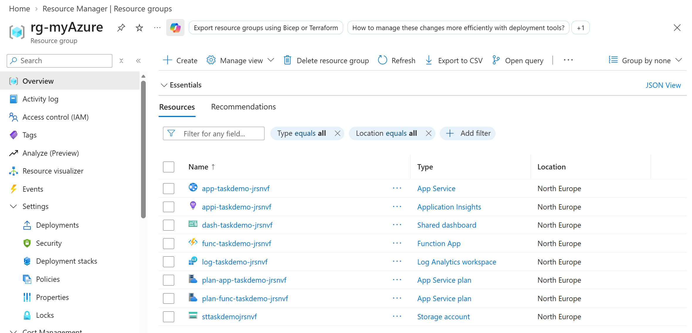
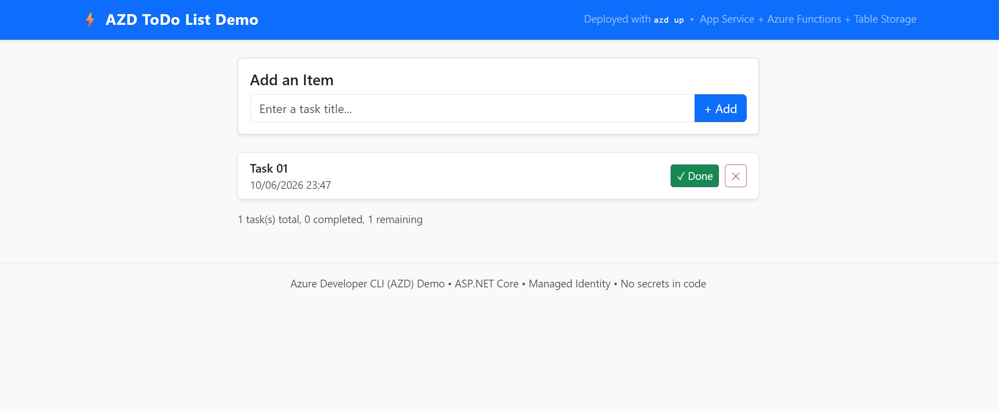

# Azure Developer CLI ToDo List Demo

This guide is a suggested walkthrough for demonstrating the AZD ToDo List sample. The application is an ASP.NET Core Razor Pages web app backed by an Azure Functions HTTP API and Azure Table Storage. Azure Developer CLI (`azd`) provisions the infrastructure and deploys both application services. The Function App uses a system-assigned managed identity to access Storage; no storage account keys or connection strings are required by the application.

## 1. What Resources are getting deployed

The deployment creates a resource group for the selected AZD environment. Resource names use the environment name and a short generated suffix, so the exact names differ for each environment.

| Resource | Example name | Purpose |
| --- | --- | --- |
| Resource group | `rg-<environment-name>` | Contains the demo resources. |
| App Service plan | `plan-app-taskdemo-<suffix>` | Basic B1 Linux plan for the web application. |
| App Service | `app-taskdemo-<suffix>` | Hosts the ASP.NET Core Razor Pages ToDo UI. |
| Functions plan | `plan-func-taskdemo-<suffix>` | Consumption (Y1) plan for the API. |
| Function App | `func-taskdemo-<suffix>` | Hosts the HTTP API used by the web application. |
| Storage account | `sttaskdemo<suffix>` | Stores task records in Azure Table Storage and supports the Functions host. Shared-key access is disabled. |
| Log Analytics workspace | `log-taskdemo-<suffix>` | Workspace used by Application Insights for telemetry. |
| Application Insights | `appi-taskdemo-<suffix>` | Collects application telemetry and supports monitoring. |
| Azure portal dashboard | `dash-taskdemo-<suffix>` | Shows request, response-time, failure, browser timing, dependency, and exception metrics. |
| Storage role assignments | Scoped to the storage account | Give the Function App managed identity the data-plane roles it needs for Blob, Queue, and Table Storage. |

The suffix is generated from the subscription, AZD environment name, and deployment region. The resource group and region are selected during `azd up`.



## 2. What can I demo from this scenario after deployment

### Open the deployed application

1. In a terminal in the project directory, run `azd env get-values` to inspect the current environment outputs.
2. Open the `SERVICE_WEB_URI` URL in a browser. You can also use the web service endpoint shown by `azd up`.
3. Point out that the page is the deployed Razor Pages application, served by Azure App Service.

### Walk through the ToDo List UI

The screenshot below shows the main page and its task-management controls.



Use the page to demonstrate the full task lifecycle:

1. **Create a task.** Enter a title in the text box and select **+ Add**. The new task appears in the list with its creation date and time.
2. **Review the task summary.** The summary below the list reports the total number of tasks, completed tasks, and tasks remaining.
3. **Complete a task.** Select **Done**. The task is marked complete, displayed with completed styling, and included in the completed count. Its Done button is no longer shown.
4. **Delete a task.** Select the **X** button to remove that task from the list and update the counts.
5. **Refresh the page.** The tasks remain available because they are stored in Azure Table Storage rather than only in the browser session.
6. **Show the empty state.** Delete the remaining tasks to show the message displayed when no tasks exist.

### Explain the request and data flow

Describe the path taken when a user adds or updates a task:

1. The browser submits the form to the Razor Pages web app running in App Service.
2. The web app's `TaskApiClient` sends an HTTP request to the Function App API.
3. The Azure Function reads or updates entities in the `tasks` Azure Table.
4. The API response is returned to the web app, which reloads the page with the updated task list and counts.

The API supports listing tasks, creating a task, marking a task complete, and deleting a task. Task records contain a title, completion status, creation time, and identifier.

### Highlight identity and storage security

1. In the Azure portal, open the Function App and show its system-assigned managed identity.
2. Open the storage account and show that shared-key access is disabled.
3. Explain that the Function App identity receives the Storage Blob Data Owner, Storage Queue Data Contributor, and Storage Table Data Contributor roles on the storage account. The Table role enables the API to read and write task data; the Blob and Queue roles support the Functions host.
4. Emphasize that the app does not need a storage account key or a storage connection string to access task data.

**Demo note:** the HTTP-triggered Functions in this sample use anonymous authorization. The managed identity secures the Function App's access to Storage; it does not authenticate users calling the HTTP API. Avoid presenting the API endpoint as protected by user authentication.

### Explore monitoring

1. Open the deployed Application Insights resource or the `dash-taskdemo-<suffix>` dashboard in the Azure portal.
2. Generate a few requests by refreshing the application and adding or completing tasks.
3. Review the available request counts, response times, failed requests, exceptions, dependency failures, browser page-load timings, and application map.

## Deployment and cleanup

For a new deployment, initialize the sample, sign in, and run `azd up`:

```bash
azd init -t massimobonanni/AZD-ToDoList
azd auth login
azd up
```

To remove the resources created for the current AZD environment, first confirm that the selected environment and resource group contain only resources you intend to delete, then run:

```bash
azd down
```

`azd down` deletes the deployed resources for that environment, including the task data in its storage account.
